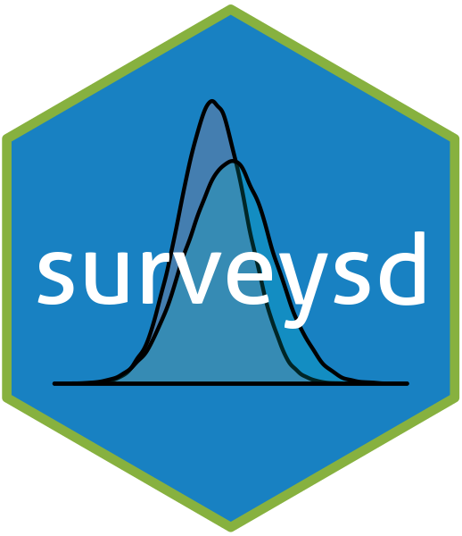

surveysd 
================================================================

[](https://travis-ci.org/statistikat/surveysd) [](https://www.tidyverse.org/lifecycle/#maturing) [](https://github.com/statistikat/surveysd/commits/master) [](https://github.com/statistikat/surveysd)

<!--[](https://coveralls.io/github/statistikat/surveysd?branch=master)-->
<!--[](https://CRAN.R-project.org/package=surveysd)-->
<!--[](https://CRAN.R-project.org/package=surveysd)-->
<!--[](http://www.awesomeofficialstatistics.org)-->
This is the development place for the R-package `surveysd`. This package can be used to estimate the standard deviation of estimates in complex surveys using bootstrap weights.

Installation
------------

This package can be installed like any other R package on github via `install_github`

``` r
devtools::install_github("statistikat/surveysd")
```

Concept
-------

Bootstrapping has long been around and used widely to estimate confidence intervals and standard errors of point estimates. This package aims to combine all necessary steps for applying a calibrated bootstrapping procedure with custom estimating functions.

Workflow
--------

-   Bootstrap samples are drawn with rescaled bootstrapping as described in `bla` in the function `draw.bootstrap()`.
-   These samples can then be calibrated with an iterative proportional updating algorithm using `recalib()`.
-   Finally, estimation functions can be applied over all bootstrap replicates with `calc.stError()`.

Further reading
---------------

-   Simple syntax examples can be found in the [getting started vignette](https://statistikat.github.io/surveysd/articles/surveysd.html).
-   The methodology is covered in the [methodology vignette](https://statistikat.github.io/surveysd/articles/Methodology.html).
